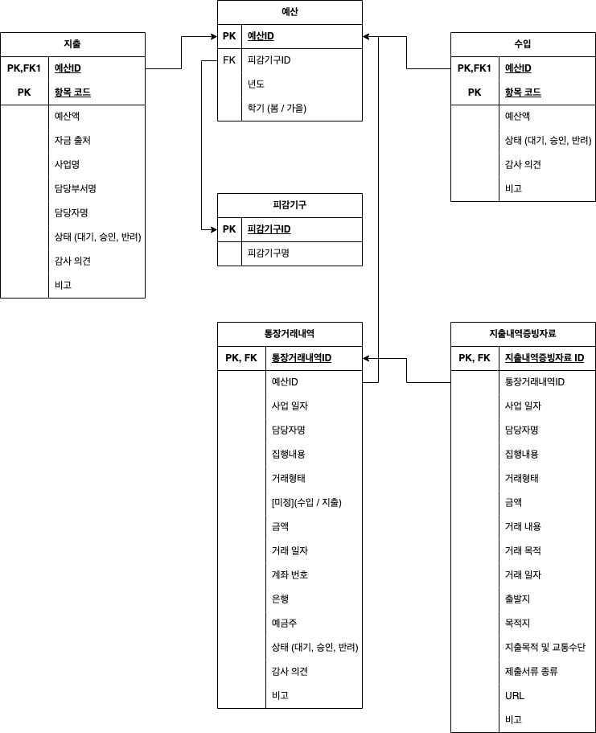

# board-of-audit-and-inspection-system

KAIST board of audit and inspection system backend

## Dependency

-   `Node.js` and `Express.js`
-   `postgreSQL`
-   `Redis`
-   `sequelize` as a ORM

## Usage

Is it recommended to run with [Docker](https://www.docker.com/)

First off, setup .env with DB and S3 information.

```
mv .env.sample .env
```

For local execution, default environmental variables of database is as following:

```
DB_HOST = postgresql
DB_PORT = 5432
DB_USER = postgres
DB_PASSWORD = password
```

### In production

```
docker compose up
```

### In development

```
docker compose -f compose-dev.yaml up

// set node version, or you can manually install `node:v18.12.0`
nvm install
nvm use

npm run dev
```

## ER-Diagram


