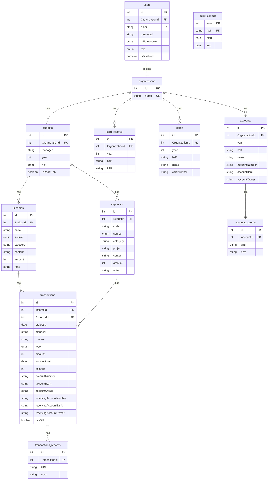

# KAIST 감사원 시스템

KAIST board of audit and inspection system backend

## Usage

```
docker compose up
```

For development

```
docker compose -f compose-dev.yaml up
npm run dev
```

## How to contribute?

1. **CAUTION**: new commits of `master` branch cause automatic the deployment to published API server. It might cause unexpected API errors or data losses.
2. Refer to [CONTRIBUTING.md](CONTRIBUTING.md)

## API Document

[API document](https://dev-bai.gdsckaist.com/api-docs)

## Documentation

-   [Architecture](docs/architecture.md)

### ERD



### Deployment


## Maintainer

| Name                                        | Email                   |
| ------------------------------------------- | ----------------------- |
| [Kyungho Byoun](https://github.com/byunk)   | kyungho.byoun@gmail.com |
| [Youngmin Ryou](https://github.com/yym0329) | yym3055@gmail.com       |
