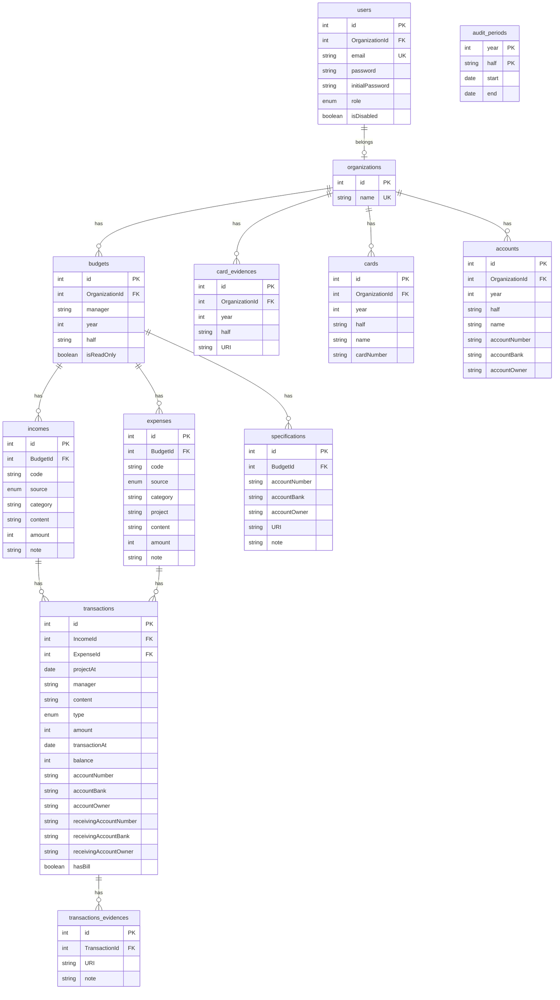
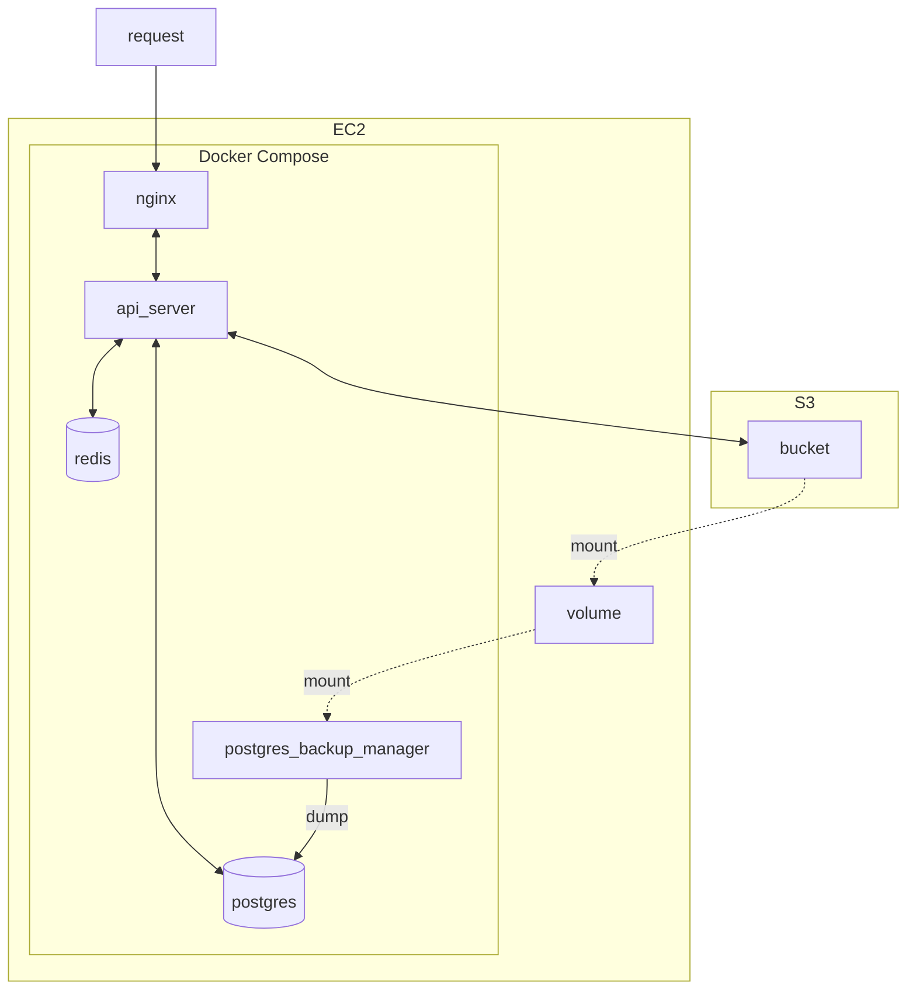

# KAIST 감사원 시스템

KAIST board of audit and inspection system backend

## Usage

```
docker compose up
```

For development

```
docker compose -f compose-dev.yaml up
npm run dev
```

## API Document

[API document](https://dev-bai.gdsckaist.com/api-docs)

## Documentation

-   [Architecture](docs/architecture.md)

### ERD



### Deployment



## Maintainer

| Name                                      | Email                   |
| ----------------------------------------- | ----------------------- |
| [Kyungho Byoun](https://github.com/byunk) | kyungho.byoun@gmail.com |
|                                           |                         |
